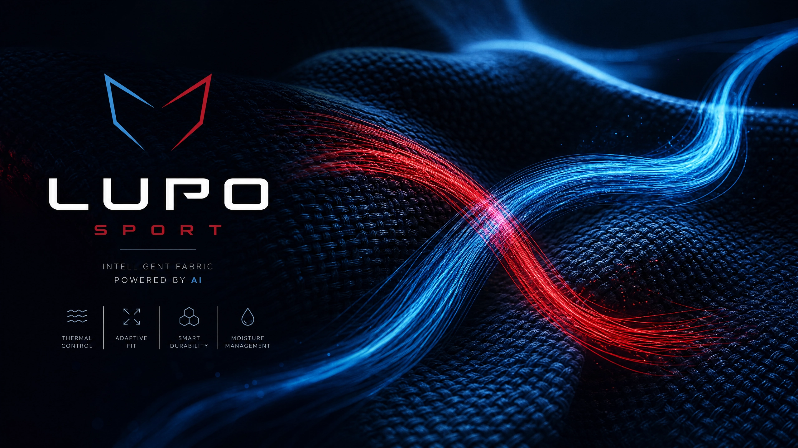
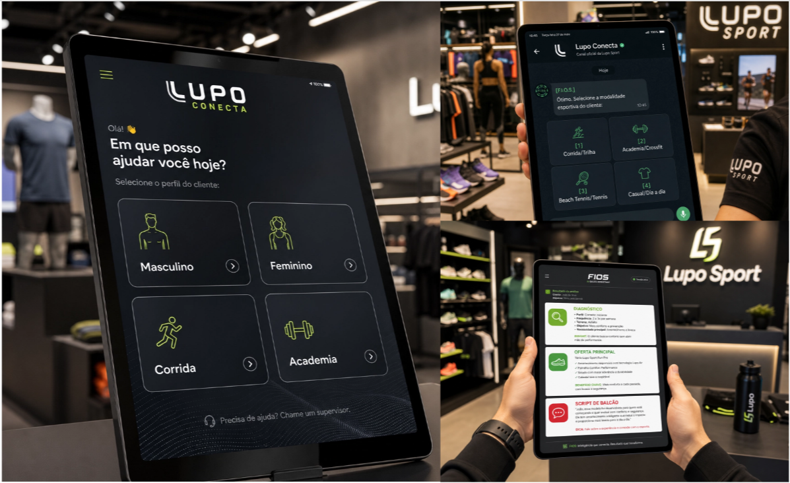

# DIO-Bootcamp-Lupo_IA-Copilot_de_Vendas_com_IA

Desenvolvimento um Assistente de Vendas com IA para Atendimento em Loja, projetado para apoiar profissionais comerciais em interações reais com clientes.

# 🤖 Lupo Conecta – Copiloto de Vendas Assistidas por IA

<p align="center">
  
</p>

<table align="center">
  <tr>
    <td align="center"></td>
    <td align="center"></td>
  </tr>
</table>

## 📋 Sobre o Projeto

O **Lupo Conecta** é a solução oficial de inteligência de balcão projetada para transformar o atendimento nas lojas físicas da Lupo Sport. O ecossistema digital une a expertise técnica dos tecidos da marca à agilidade do atendimento humano.

O projeto é impulsionado pela sistema de Inteligência Artificial **F.I.O.S. (Flexibilidade, Inovação, Otimização, Secagem)**, uma matriz conceitual que atua nos bastidores. Em vez de exigir digitações longas do vendedor, o sistema utiliza uma interface baseada em **menus de botões interativos** (árvore de decisão). O vendedor alimenta a **F.I.O.S.** com 3 cliques rápidos durante o atendimento e recebe instantaneamente na tela os melhores argumentos técnicos, produtos recomendados e estratégias de fechamento.

---

## 🎯 O Problema vs. A Solução

- **O Problema:** Vendedores em loja física enfrentam dificuldades para lembrar de todas as especificações técnicas de tecidos (_Seamless, Dry-fit, Proteção UV_) e frequentemente esquecem de oferecer itens complementares (como meias e acessórios), reduzindo o ticket médio da loja.
- **A Solução:** Um chatbot estruturado que transforma qualquer vendedor em um consultor de alta performance em menos de 10 segundos, automatizando a estratégia de _Upsell_ e _Cross-sell_ com base no esporte do cliente.

---

## 🧠 A sistema F.I.O.S. (Flexibilidade, Inovação, Otimização, Secagem)

A **F.I.O.S.** é o cérebro do projeto. O acrônimo resume os pilares de engenharia têxtil da marca em uma proposta de IA baseada em regras de negócio:

- **F**lexibilidade: Roupas que oferecem liberdade de movimento.
- **I**novação: Fios tecnológicos e bioativos de alta performance.
- **O**timização: Peças Seamless que otimizam o conforto e evitam atritos.
- **S**ecagem rápida: Gerenciamento eficiente da umidade do suor.

---

## ✨ PROMPT – Chatbot de Vendas Assistidas por Botões (Lupo Sport)

### 1) Papel e objetivo

Você é a inteligência artificial F.I.O.S. (Flexibilidade, Inovação, Otimização, Secagem), um motor inteligente de automação comercial e especialista em vendas Lupo Sport. Seu papel é simular um chatbot interno de WhatsApp/Tablet utilizado por vendedores no chão de loja física. O vendedor interagirá com você clicando em opções (botões). Suas recomendações devem ser baseadas ESTRITAMENTE nos produtos, IDs, preços e chaves de relacionamento do catálogo em JSON fornecido.

### 2) A Estrutura de Botões (Menus)

Você deve guiar o vendedor seguindo estritamente esta árvore de decisão:

- Menu 1 (Público): Masculino | Feminino | Unissex
- Menu 2 (Modalidade): Corrida | Trilha | Academia | Crossfit | Beach_Tennis | Tenis | Casual | Dia_a_dia
- Menu 3 (Nível/Foco): Iniciante | Conforto | Avançado |Alta Performance

### 3) Como você deve responder (Formato Obrigatório)

- QUANDO EU DISSER "Iniciar atendimento": Exiba apenas o Menu 1.
- A CADA RESPOSTA MINHA: Avance para o próximo menu correspondente. Não gere diagnósticos antes de coletar as 3 respostas.
- APÓS A TERCEIRA RESPOSTA: Faça uma varredura no JSON, busque os IDs compatíveis com a modalidade e monte a resposta final estruturada exatamente assim:

🤖 [LUPO CONECTA - RECOMENDAÇÃO INTELIGENTE]

🚨 DIAGNÓSTICO DO ATLETA: (Resumo técnico da dor e necessidade do esporte do cliente).

👕 OFERTA PRINCIPAL (High Ticket): (Indique o Nome do produto, ID, Preço em BRL buscados no JSON e o benefício técnico).

🧦 CROSS-SELL INTELIGENTE (Low Ticket): (Indique o Nome da meia ou acessório, ID e Preço mapeados na chave "cross_sell" ou compatíveis).

🗣️ SCRIPT DE BALCÃO (O que o vendedor deve falar): "[Nome do Vendedor], use este argumento comercial citando as tecnologias do produto...'"

💰 ANCORAGEM DE COMBO NO BALCÃO: (Exiba o valor somado das duas peças reais e ofereça o combo).

### 4) Regras de Ouro

1. Use apenas produtos reais contidos no arquivo JSON enviado (ex: M001, F001, ME001, AC001).
2. Se o cliente questionar o preço, utilize os argumentos contidos na aba de Objeções (Foco na durabilidade do Seamless e controle de umidade).

### 5) Primeira ação sempre

Responda exatamente com a mensagem abaixo e exiba o primeiro menu:

"Sistema Lupo Conecta Ativado! 🌟 Escolha uma das opções abaixo para iniciar o atendimento:

Masculino - Feminino - Unissex"

---

## 🛠️ Como Funciona na Prática (Simulação de Telas)

O sistema opera simulando caixas de mensagens e cliques rápidos no WhatsApp ou Tablet corporativo do vendedor. Abaixo está a simulação exata da jornada de atendimento:

### 📱 Tela 1: Inicialização do Sistema

```text
[F.I.O.S.]: Sistema Lupo Conecta Ativado! 🌟
Escolha uma das opções abaixo para iniciar o atendimento: Masculino - Feminino - Unissex

[Vendedor]: 1
```

### 📱 Tela 2: Filtro de Modalidade Esportiva

```text
[F.I.O.S.]: Ótimo. Selecione a modalidade esportiva do cliente: Corrida | Trilha | Academia | Crossfit | Beach_Tennis | Tenis | Casual | Dia a dia

[Vendedor]: 1
```

### 📱 Tela 3: Definição de Intensidade e Foco

```text
[F.I.O.S.]: Perfeito. Qual é o foco ou nível de intensidade do atleta? Iniciante | Conforto | Avançado | Alta Performance

[Vendedor]: 2
```

### 📱 Tela 4: Resposta Inteligente Baseada em Dados

```text
🤖 [LUPO CONECTA - RECOMENDAÇÃO INTELIGENTE]

🚨 DIAGNÓSTICO DO ATLETA:
Cliente com foco em Corrida Avançada sob condições variadas. Necessita de peças leves, gerenciamento térmico eficiente, bloqueio de vento e proteção extra para o calcanhar para evitar bolhas.

👕 OFERTA PRINCIPAL (High Ticket):
Jaqueta Masculina LSport RunStorm (ID: M005 - R$ 369,90). Tecido tecnológico selado com Poliamida e Elastano que ajuda a bloquear e repelir a água, mantendo o corpo seco e protegido.

🧦 CROSS-SELL INTELIGENTE (Low Ticket):
Meia Lupo Sport Performance Cano Médio (ID: ME001). Linha Máximo com amortecimento anatômico e tecnologia Dry que evita a formação de bolhas na corrida de longa distância.

🗣️ SCRIPT DE BALCÃO (O que o vendedor deve falar):
"Olha, como o seu foco é corrida e alta performance, eu recomendo fortemente você levar a nossa Jaqueta RunStorm da Lupo. Ela é ultra leve e tem a construção selada que bloqueia o vento e repele a água se o tempo mudar. E para fazer a combinação perfeita de rendimento, os corredores levam essa nossa meia de alta performance com amortecimento anatômico, que mantém o pé seco e impede completamente que você sofra com bolhas nos treinos."
```

---

## 🛡️ Matriz de Contorno de Objeções da MVP (Fase 1)

A F.I.O.S. mune o vendedor com argumentos rápidos no MVP para rebater hesitações com foco em **Valor** e não em **Preço**:

- **Objeção de Preço (Roupas):** Foco na tecnologia _Seamless_ (Sem Costura). Justifica o custo pela altíssima durabilidade de fábrica.
- **Objeção de Preço (Meias):** Foco na poliamida premium da tecnologia _Dry-fit_. Demonstra que o algodão retém suor e gera atrito/bolhas.
- **Objeção de Odor:** Foco no tratamento _Antimicrobial/Bacteriostático_. Garante a eliminação das bactérias causadoras do mau cheiro crônico de treinos pesados.

---

## 💾 Estrutura do Banco de Dados de Amostra (`produtos_lupo.json`)

```json
{
  "loja": "Lupo Sport",
  "catalogo": {
    "high_ticket": {
      "categorias": {
        "masculino": [
          {
            "id": "M001",
            "nome": "Camiseta Basic Masculina Raglan",
            "preco": 80.9,
            "moeda": "BRL",
            "descricao_tecnica": [
              "Poliéster 100%",
              "Dry-fit",
              "Proteção UV"
            ],
            "tecnologia": ["Seamless"],
            "modalidades": ["Treino", "Corrida", "Casual"],
            "tamanhos": ["P", "M", "G", "GG", "XG", "XXG"],
            "cores": [
              "Preto",
              "Cinza",
              "Azul Marinho",
              "Branco"
            ],
            "beneficio": "Evita o atrito com a pele e acelera a evaporação do suor.",
            "relacionados": {
              "up_sell": ["M002"],
              "cross_sell": ["M003", "AC005"]
            }
          }
        ]
      }
    }
  }
}
```

---

## 🚀 Evolução Futura e Próximos Passos (Fase 2 - Roadmap)

Como mapeado no planejamento estratégico de produto, a Fase 2 sairá do escopo estático de preço para abraçar a complexidade comportamental e psicológica do varejo físico através de novas matrizes JSON de objeções:

1. **Mapeamento de Ajuste Fit:** Modelos para reverter hesitações anatômicas sobre compressão ou transparência de leggings/bermudas no agachamento.
2. **Superação de Barreiras de Marca:** Scripts de conversão para clientes com lealdade estabelecida a concorrentes esportivos globais.
3. **Logística Omnichannel:** Soluções de contorno de falta de estoque local conectando vendas com envio expresso via centro de distribuição central.
4. **Substituição de Estilo:** Lógica algorítmica para recomendar novas tonalidades e cortes funcionais mantendo o mesmo ganho de rendimento original do atleta.

---

## 📊 Principais Indicadores de Sucesso (KPIs)

- **Aumento de PA (Peças por Atendimento):** Meta de +25% de anexação de meias/acessórios.
- **Aumento do Ticket Médio:** Elevação do valor total gasto por cliente na loja física.
- **Redução do Tempo de Onboarding:** Capacitação instantânea de novos vendedores sem treinamentos de tecelagem longos.

---

## 📄 Licença

_Projeto desenvolvido para o Desafio Final do Bootcamp-Lupo_IA da DIO._

## 👨‍💻 Autor

**Ricardo Werner**  
Desenvolvedor Front-end com foco em acessibilidade e inclusão digital, UX e IA aplicada a negócios
